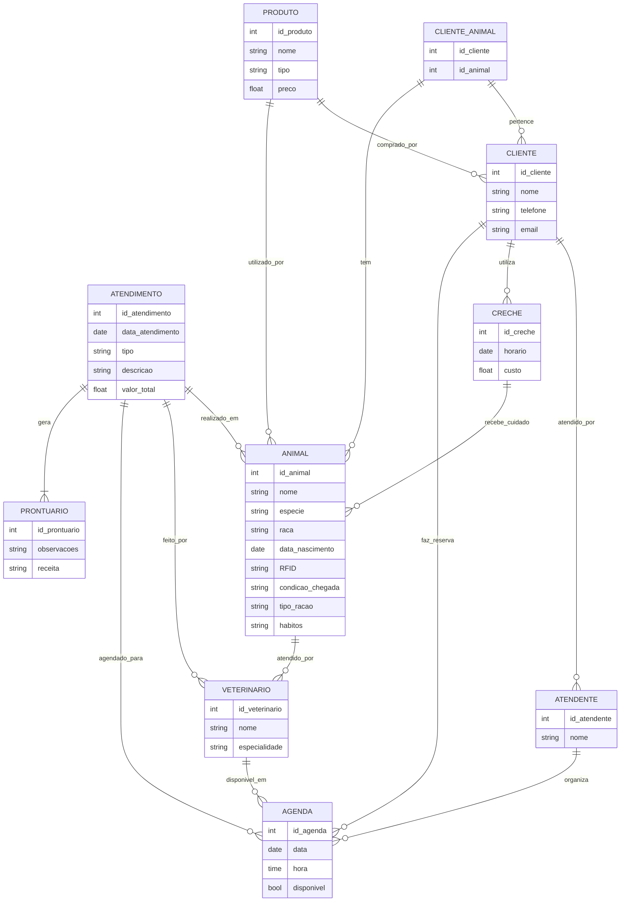

# Angel Rafael Souza da Silva
Repositório para engenhario de software modelagem de dados.

- [Angel Rafael / Souza \_AXO](#Angel_axo)
- [1. Introdução](#1-introdução)
- [2. Problema e descrição do negócio.](#2-problema-e-descrição-do-negócio)
- [3. Visão geral do sistema](#3-visão-geral-do-sistema)
- [4. Diagrama ER](#4-diagrama-er)
- [5. Diagrama de classe](#5-diagrama-de-classe)
- [6. Casos de uso](#6-casos-de-uso)
- [6.1 Histórias de usuário](#61-histórias-de-usuário)
- [7. Diagrama de componentes](#7-diagrama-de-componentes)
- [8. Diagrama de implantação](#8-diagrama-de-implantação)
- [9. Protótipo de telas](#9-protótipo-de-telas)
- [10. Diagrama de navegação de telas.](#10-diagrama-de-navegação-de-telas)
- [11. Pilha tecnológica](#11-pilha-tecnológica)
- [12. Requisitos de sistema](#12-requisitos-de-sistema)
- [13. Considerações sobre segurança](#13-considerações-sobre-segurança)
- [14. Manutenção e instalação](#14-manutenção-e-instalação)
- [15. Glossário](#15-glossário)
- [16. Script SQL](#16-script-sql)

# 1. Introdução

O projeto a seguir apresenta um sistema desenvolvido para um petshop. A empresa é considerada micro e iniciou as atividades recentemente. Ao possuir serviços exclusivos, os sistemas presentes no mercado não se enquadra, desta forma, os propietários decidiram desenvolver uma solução própria. Esta solução é detalhada a seguir.

# 2. Problema e descrição do negócio.

Descrição do cenário onde o sistema deverá funcionar.

1. Marcar animais com RFID.
2. Realizar procedimento de vacinação de banho e tosa.
3. Uma clínica veterinária atende apenas os animais: gatos e cachorros. 
4. Os clientes devem fazer um cadastro de si e dos animais.
5. Os clientes devem informar as condições nas quais os animais chegam.
6. Os clientes devem informar o tipo de ração que o animal come. 
7. O cliente deve informar hábitos do animal. 
8. Para cada animal é possível que mais de um veterinário o atenda. 
9. Os animais podem chegar e serem atendidos de acordo com uma agenda do dia. 
10. Cada animal atendido receberá uma ficha e um prontuário. 
11. Outros dono podem querer marcar horários de atendimento futuro. 
12. O atendimento gera uma receita para o animal. 
13. Quando um cliente chega na clínica veterinária ele é atendido por um atendente. 
14. O atendente deve verificar se existe agenda disponível com um veterinário. 
15. O atendente deve colocar o cliente e seu animal na fila de espera, se for o caso. 
16. O atendente deve levar o cliente e o animal até o veterinário. 
17. O veterinário deve realizar uma entrevista com o dono do animal. 
18. O resultado da entrevista deve ir para um formulário. 
19. O veterinário deverá examinar o animal e anotar em prontuário(ficha) suas observações. 
20. Dependendo da situação do animal este receberá uma receita.
21. A Petshop vende rações para os animais de raças: felinas, canídeas, aves, roedores.
22. A Petshop fornece atendimento para creche de animais, onde deve ser informado horário e custo.
23. A Petshop vende roupas e acessórios para animais.
24. A Petshop vende produtos para banho para os animais.
25. A Petshop vende roupas para animais.
26. A Petshop fica localizada no centro.
27. A Petshop deve cuidar do animal ate o dono buscar.
28. A Petshop assumi responsabilidade pelos animais dentro do seu estabelecimento.
29. O animal ficara em local adequado até o retorno do responsável.
30. O valor total.

# 3. Visão geral do sistema

# 4. Diagrama ER

# 5. Diagrama de classe

# 6. Casos de uso

# 6.1 Histórias de usuário

# 7. Diagrama de componentes

# 8. Diagrama de implantação

# 9. Protótipo de telas

# 10. Diagrama de navegação de telas.

# 11. Pilha tecnológica

# 12. Requisitos de sistema

# 13. Considerações sobre segurança

# 14. Manutenção e instalação

# 15. Glossário

# 16. Script SQL
