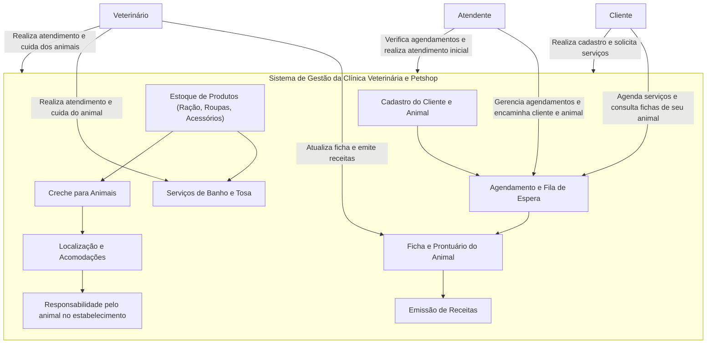

# Angel Rafael Souza da Silva

Repositório para engenhario de software modelagem de dados.

- [Angel Rafael / Souza \_AXO](#Angel_axo)
- [1. Introdução](#1-introdução)
- [2. Problema e descrição do negócio.](#2-problema-e-descrição-do-negócio)
- [3. Visão geral do sistema](#3-visão-geral-do-sistema)
- [4. Diagrama ER](#4-diagrama-er)
- [5. Diagrama de classe](#5-diagrama-de-classe)
- [6. Casos de uso](#6-casos-de-uso)
  - [6.1 Histórias de usuário](#61-histórias-de-usuário)
- [7. Diagrama de componentes](#7-diagrama-de-componentes)
- [8. Diagrama de implantação](#8-diagrama-de-implantação)
- [9. Diagrama C4](#9-diagrama-c4)
  - [9.1 Diagrama de contexto](#91-diagrama-de-contexto)
  - [9.1 Diagrama de container](#92-diagrama-de-container)
  - [9.1 Diagrama de codigo](#93-diagrama-de-codigo)
- [9. Protótipo de telas](#9-protótipo-de-telas)
- [10. Diagrama de navegação de telas.](#10-diagrama-de-navegação-de-telas)
- [11. Pilha tecnológica](#11-pilha-tecnológica)
- [12. Requisitos de sistema](#12-requisitos-de-sistema)
- [13. Considerações sobre segurança](#13-considerações-sobre-segurança)
- [14. Manutenção e instalação](#14-manutenção-e-instalação)
- [15. Glossário](#15-glossário)
- [16. Script SQL](#16-script-sql)

# 1. Introdução

O projeto a seguir apresenta um sistema desenvolvido para um petshop. A empresa é considerada micro e iniciou as atividades recentemente. Ao possuir serviços exclusivos, os sistemas presentes no mercado não se enquadra, desta forma, os propietários decidiram desenvolver uma solução própria. Esta solução é detalhada a seguir.

# 2. Problema e descrição do negócio.

Descrição do cenário onde o sistema deverá funcionar.

1. Marcar animais com RFID.
2. Realizar procedimento de vacinação de banho e tosa.
3. Uma clínica veterinária atende apenas os animais: gatos e cachorros.
4. Os clientes devem fazer um cadastro de si e dos animais.
5. Os clientes devem informar as condições nas quais os animais chegam.
6. Os clientes devem informar o tipo de ração que o animal come.
7. O cliente deve informar hábitos do animal.
8. Para cada animal é possível que mais de um veterinário o atenda.
9. Diagrama C4
11. Os animais podem chegar e serem atendidos de acordo com uma agenda do dia.
12. Cada animal atendido receberá uma ficha e um prontuário.
13. Outros dono podem querer marcar horários de atendimento futuro.
14. O atendimento gera uma receita para o animal.
15. Quando um cliente chega na clínica veterinária ele é atendido por um atendente.
16. O atendente deve verificar se existe agenda disponível com um veterinário.
17. O atendente deve colocar o cliente e seu animal na fila de espera, se for o caso.
18. O atendente deve levar o cliente e o animal até o veterinário.
19. O veterinário deve realizar uma entrevista com o dono do animal.
20. O resultado da entrevista deve ir para um formulário.
21. O veterinário deverá examinar o animal e anotar em prontuário(ficha) suas observações.
22. Dependendo da situação do animal este receberá uma receita.
23. A Petshop vende rações para os animais de raças: felinas, canídeas, aves, roedores.
24. A Petshop fornece atendimento para creche de animais, onde deve ser informado horário e custo.
25. A Petshop vende roupas e acessórios para animais.
26. A Petshop vende produtos para banho para os animais.
27. A Petshop vende roupas para animais.
28. A Petshop fica localizada no centro.
29. A Petshop deve cuidar do animal ate o dono buscar.
30. A Petshop assumi responsabilidade pelos animais dentro do seu estabelecimento.
31. O animal ficara em local adequado até o retorno do responsável.
32. O valor total.

# 3. Visão geral do sistema

O sistema proposto para a clínica veterinária e petshop foi desenvolvido para otimizar o atendimento aos clientes, organizar os procedimentos de cuidado com os animais, e facilitar a gestão de produtos e serviços oferecidos. O fluxo de operações vai desde o cadastro de clientes e animais até o agendamento de consultas e procedimentos como vacinação, banho e tosa. Além disso, o sistema possibilita o controle de vendas de produtos, como rações, acessórios, e serviços de creche.

O sistema também lida com a administração da agenda de veterinários, permitindo que o atendente organize o fluxo de atendimento e atribua o animal ao profissional disponível. Ele gerencia prontuários, receitas e outras informações relacionadas ao histórico de saúde dos animais, garantindo que os dados sejam armazenados de forma segura e acessível. Os prontuários são criados a partir dos exames realizados pelos veterinários e as observações registradas durante o atendimento.

Além disso, o petshop é integrado ao sistema para gerenciar a venda de produtos para os animais e a prestação de serviços complementares, como creche e cuidados temporários. O sistema fornece funcionalidades para que os clientes reservem horários futuros e acompanhem a situação do atendimento de seus animais, seja durante consultas ou em serviços como banho e tosa.

A funcionalidade de RFID garante a identificação precisa dos animais, melhorando a gestão de cadastro e facilitando a recuperação de informações durante os atendimentos. Dessa forma, o sistema oferece uma solução completa, integrando a gestão clínica com as operações comerciais do petshop, visando eficiência e melhoria na experiência dos clientes e no cuidado com os animais.

# 4. Diagrama ER


# 5. Diagrama de classe


# 6. Casos de uso


# 6.1 Casos de uso

@startuml
actor Cliente
actor Atendente
actor Veterinario
actor Petshop

usecase "Cadastrar Cliente" as UC1
usecase "Cadastrar Animal" as UC2
usecase "Informar Condições de Chegada" as UC3
usecase "Informar Tipo de Ração" as UC4
usecase "Informar Hábitos" as UC5
usecase "Marcar Animal com RFID" as UC6
usecase "Atendimento Veterinário" as UC7
usecase "Realizar Procedimento de Banho e Tosa" as UC8
usecase "Realizar Entrevista com Dono" as UC9
usecase "Examinar Animal" as UC10
usecase "Gerar Prontuário" as UC11
usecase "Gerar Receita" as UC12
usecase "Verificar Agenda Disponível" as UC13
usecase "Colocar Cliente na Fila de Espera" as UC14
usecase "Levar Animal para o Veterinário" as UC15
usecase "Vender Rações" as UC16
usecase "Vender Roupas e Acessórios" as UC17
usecase "Vender Produtos para Banho" as UC18
usecase "Cuidar do Animal até Busca" as UC19
usecase "Oferecer Serviço de Creche" as UC20

Cliente --> UC1
Cliente --> UC2
Cliente --> UC3
Cliente --> UC4
Cliente --> UC5
Cliente --> UC8
Cliente --> UC9

Atendente --> UC13
Atendente --> UC14
Atendente --> UC15

Veterinario --> UC9
Veterinario --> UC10
Veterinario --> UC11
Veterinario --> UC12

Petshop --> UC6
Petshop --> UC16
Petshop --> UC17
Petshop --> UC18
Petshop --> UC19
Petshop --> UC20

UC9 --> UC11
UC10 --> UC12
@enduml

# 6.2 Histórias de usuário

1. Cadastro de Clientes e Animais
   Como um cliente,
   Eu quero realizar o cadastro dos meus dados pessoais e dos meus animais,
   Para que a clínica veterinária possa ter minhas informações e as dos meus pets registradas.

2. Informar Condições e Hábitos do Animal
   Como um cliente,
   Eu quero informar as condições de saúde e os hábitos alimentares e comportamentais dos meus animais,
   Para que o veterinário e a clínica possam prestar o atendimento adequado.

3. Agendar Atendimento Veterinário
   Como um cliente,
   Eu quero agendar o atendimento de meus animais com um veterinário,
   Para garantir que eles recebam os cuidados necessários no horário adequado.

4. Atendimento por Múltiplos Veterinários
   Como um cliente,
   Eu quero que meus animais possam ser atendidos por mais de um veterinário,
   Para que cada profissional cuide de diferentes necessidades do meu pet, se necessário.

5. Receber Ficha e Prontuário do Animal
   Como um veterinário,
   Eu quero criar uma ficha e um prontuário para cada animal atendido,
   Para registrar o histórico de saúde e cuidados realizados no animal.

6. Fila de Espera para Atendimento Veterinário
   Como um atendente,
   Eu quero verificar a disponibilidade de agenda com os veterinários e, caso necessário,
   Colocar o cliente e seu animal na fila de espera,
   Para garantir que todos os animais sejam atendidos de maneira organizada.

7. Realizar Entrevista Inicial com o Dono
   Como um veterinário,
   Eu quero realizar uma entrevista inicial com o dono do animal,
   Para entender o motivo da consulta e coletar informações essenciais para o atendimento.

8. Anotar Observações no Prontuário
   Como um veterinário,
   Eu quero anotar no prontuário todas as observações e resultados do exame do animal,
   Para registrar o estado de saúde e possíveis tratamentos.

9. Gerar Receita para Tratamento
   Como um veterinário,
   Eu quero emitir uma receita de medicamentos ou tratamentos para o animal,
   Para que o dono possa seguir com o tratamento adequado.

10. Serviço de Creche para Animais
    Como um cliente,
    Eu quero deixar meu animal na creche da petshop,
    Para que ele seja cuidado enquanto estou ausente, com horário de entrada e custo informados.

11. Vender Rações e Produtos para Animais
    Como um cliente,
    Eu quero comprar ração, roupas e acessórios para meu animal,
    Para que ele tenha alimentação e conforto adequados.

12. Cuidar dos Animais na Petshop
    Como um cliente,
    Eu quero que a petshop cuide do meu animal até que eu o busque,
    Para que ele fique seguro e confortável no estabelecimento.

13. Garantir Local Adequado para Animais na Petshop
    Como o proprietário da petshop,
    Eu quero garantir que todos os animais fiquem em locais adequados até o retorno de seus donos,
    Para oferecer um ambiente seguro e confortável.

14. Vender Produtos de Higiene para Animais
    Como um cliente,
    Eu quero comprar produtos de higiene, como shampoos e acessórios para banho,
    Para manter a limpeza e a saúde do meu animal.

15. Valor Total dos Serviços e Produtos
    Como um cliente,
    Eu quero ser informado do valor total dos serviços e produtos adquiridos,
    Para que eu saiba o custo completo ao final da visita.

16. Responsabilidade pelos Animais no Estabelecimento+
    Como o proprietário da petshop,
    Eu quero assumir a responsabilidade pelos animais enquanto estiverem em meu estabelecimento,
    Para garantir que os donos confiem na segurança e cuidado que oferecemos.

17. Atendimento por Agendamento ou Ordem de Chegada
    Como um cliente,
    Eu quero que meu animal seja atendido na clínica veterinária conforme o agendamento ou pela ordem de chegada,
    Para que ele receba os cuidados no momento certo.

18. Marcar Atendimentos Futuros
    Como um cliente,
    Eu quero agendar atendimentos veterinários para datas futuras,
    Para garantir que meu animal receba acompanhamento contínuo e planejado.

19. Atendimento ao Chegar na Clínica
    Como um cliente,
    Eu quero ser atendido por um atendente assim que chego na clínica veterinária,
    Para que meu animal seja prontamente direcionado ao veterinário.

20. Verificar Agenda de Veterinários Disponíveis
    Como um atendente,
    Eu quero verificar a agenda dos veterinários disponíveis,
    Para agendar ou organizar o atendimento dos animais de acordo com a disponibilidade.

21. Levar Cliente e Animal ao Veterinário
    Como um atendente,
    Eu quero levar o cliente e seu animal até o veterinário responsável,
    Para que o atendimento aconteça de forma organizada e sem atrasos.

22. Realizar Marcação de Animais com RFID
    Como um veterinário,
    Eu quero marcar os animais com RFID,
    Para facilitar a identificação e rastreamento de cada pet atendido.

23. Realizar Procedimentos de Banho e Tosa
    Como um cliente,
    Eu quero que a clínica veterinária ou petshop realize o serviço de banho e tosa no meu animal,
    Para garantir que ele esteja sempre limpo e bem cuidado.

24. Vender Rações Específicas para Cada Tipo de Animal
    Como um cliente,
    Eu quero que a petshop tenha rações específicas para cada tipo de animal (felinos, canídeos, aves, roedores),
    Para que eu possa adquirir o alimento mais adequado ao meu pet.

25. Disponibilizar Receitas no Sistema
    Como um cliente,
    Eu quero que as receitas veterinárias estejam disponíveis no sistema da clínica,
    Para poder acessar a qualquer momento o tratamento prescrito para meu animal.

26. Entregar Animais Após Banho, Tosa ou Creche
    Como um cliente,
    Eu quero buscar meu animal após a realização dos serviços de banho, tosa ou creche,
    Para que ele esteja pronto para ir para casa no horário combinado.

27. Cadastro de Produtos e Serviços
    Como um atendente da petshop,
    Eu quero cadastrar produtos como ração, roupas, acessórios e serviços como creche, banho e tosa,
    Para oferecer uma variedade de opções aos clientes da loja.

28. Emitir Relatórios de Atendimentos e Vendas
    Como o proprietário da petshop,
    Eu quero gerar relatórios sobre os atendimentos realizados e os produtos vendidos,
    Para ter controle sobre o faturamento e a eficiência dos serviços prestados.

29. Cálculo do Custo Total dos Serviços
    Como um cliente,
    Eu quero que o sistema me mostre o custo total dos serviços prestados (creche, banho, tosa, consulta veterinária),
    Para que eu saiba quanto precisarei pagar no final.

30. Garantir a Segurança dos Animais na Creche
    Como o proprietário da petshop,
    Eu quero garantir a segurança dos animais que ficam na creche,
    Para que os donos sintam confiança em deixar seus pets no local durante o dia.

# 7. Diagrama de componentes


# 8. Diagrama de implantação


# 9 Diagrama C4


# 9.1 Diagrama de contexto

# 9.2 Diagrama de container


# 9.3 Diagrama de codigo

# 9. Protótipo de telas


agenda: 

dashboard: 

graficos: 


# 10. Diagrama de navegação de telas.


# 11. Pilha tecnológica


# 12. Requisitos de sistema

Um servidor de banco para hospedar seu banco de dados, um servidor de aplicação para rodar a sua aplicação, sistema opereacional, conectividade a rede,  servidores de aplicação: PHP


# 13. Considerações sobre Segurança

A segurança é um aspecto crucial para evitar perda de dados e vazamentos em um sistema de gestão, como o de uma clínica veterinária e petshop. Abaixo estão as práticas recomendadas para garantir a proteção do sistema e das informações sensíveis:

## 1. Autenticação e Controle de Acesso
- **Autenticação Forte**: Utilize autenticação multifatorial (MFA) para adicionar uma camada extra de segurança além de senhas, como tokens ou códigos enviados via SMS/Email.
- **Política de Senhas**: Exija senhas fortes, com combinação de letras, números e símbolos, para reduzir o risco de acesso não autorizado.
- **Controle de Acesso Baseado em Funções (RBAC)**: Limite o acesso a diferentes áreas do sistema com base nos papéis dos usuários. Por exemplo, apenas veterinários podem acessar prontuários, enquanto atendentes gerenciam a agenda.

## 2. Criptografia de Dados
- **Criptografia de Dados em Trânsito**: Use HTTPS para garantir que toda a comunicação entre cliente e servidor esteja criptografada.
- **Criptografia de Dados em Repouso**: Criptografe dados sensíveis no banco de dados, como informações de clientes e prontuários dos animais, utilizando algoritmos seguros como AES-256.
- **Proteção de Senhas**: Armazene senhas usando algoritmos de hashing fortes, como bcrypt ou argon2, e nunca as armazene em texto plano.

## 3. Backups Regulares
- **Backups Automatizados**: Configure backups automáticos e regulares dos dados para evitar perda de informações devido a falhas ou ataques.
- **Backup Off-Site**: Armazene cópias de segurança em locais fora do ambiente principal, como serviços de nuvem (AWS S3, Google Cloud), para garantir disponibilidade em caso de desastres físicos.
- **Criptografia dos Backups**: Certifique-se de que os backups também estejam criptografados para evitar acessos indevidos.

## 4. Monitoramento e Auditoria
- **Monitoramento de Acessos**: Registre todos os acessos e eventos críticos, como tentativas de login falhadas e alterações de dados, para identificar comportamentos suspeitos.
- **Auditoria de Logs**: Revise logs de atividades no sistema para detectar vulnerabilidades e tentativas de invasão.
- **Alertas de Segurança**: Configure alertas automáticos para atividades anômalas, como múltiplas tentativas de login ou acessos não autorizados.

## 5. Prevenção de Ameaças e Atualizações
- **Firewall e IDS/IPS**: Use firewalls e sistemas de detecção e prevenção de intrusões (IDS/IPS) para proteger o sistema contra ataques externos.
- **Atualizações e Patches**: Mantenha o sistema operacional, software e bibliotecas sempre atualizados para corrigir vulnerabilidades conhecidas.
- **Proteção contra SQL Injection**: Utilize consultas preparadas ou ORM para evitar ataques de injeção de SQL.

## 6. Proteção contra Ataques Comuns
- **Prevenção contra XSS (Cross-Site Scripting)**: Sanitizar todas as entradas do usuário para evitar que scripts maliciosos sejam executados no navegador.
- **Proteção contra CSRF (Cross-Site Request Forgery)**: Utilize tokens anti-CSRF para proteger formulários e requisições.
- **Limitação de Taxa de Requisições (Rate Limiting)**: Implemente uma limitação de requisições para prevenir ataques de força bruta e DDoS.

## 7. Políticas de Segurança Internas
- **Treinamento de Usuários**: Ensine os funcionários a seguir boas práticas de segurança, como evitar phishing e usar senhas seguras.
- **Gerenciamento de Dispositivos**: Se o sistema for acessado por dispositivos móveis ou remotamente, implemente VPNs seguras e exija dispositivos com antivírus atualizados.
- **Acesso Mínimo Necessário**: Aplique o princípio do menor privilégio, garantindo que os usuários tenham acesso apenas ao necessário para realizar suas tarefas.

## 8. Serviços Externos Seguros
- **Segurança de APIs de Terceiros**: Garanta que as APIs usadas no sistema sigam práticas de segurança adequadas, como autenticação via OAuth2 e proteção contra abusos.
- **Armazenamento Seguro em Nuvem**: Ao usar serviços de nuvem, certifique-se de que os dados sejam criptografados e que as permissões de acesso estejam corretamente configuradas (ex: evitar buckets abertos).

## 9. Plano de Recuperação de Desastres
- **Plano de Contingência**: Elabore um plano de recuperação em caso de desastres, que inclua backups, servidores redundantes e comunicação clara.
- **Testes de Backup e Restauração**: Teste regularmente os backups para garantir que a restauração dos dados funcione como esperado.

## 10. Segurança Física
- **Proteção Física dos Servidores**: Garanta que os servidores estejam fisicamente protegidos contra acessos não autorizados, roubo ou desastres naturais.
- **Segurança de Dispositivos Móveis**: Implante medidas como bloqueio remoto e criptografia para proteger dispositivos móveis que acessam o sistema.


# 14. Manutenção e instalação

Instalação da Aplicação:

Instalação no Servidor: Inicie a instalação da aplicação no servidor.
Verificação de Dependências: Assegure-se de que todas as dependências necessárias estejam instaladas. Consulte a seção de Dependências para mais informações.
Verificação de Logs: Após a execução da instalação, verifique os logs gerados para confirmar que o sistema está funcionando corretamente.

Manutenção:

Manter o sistema funcionando corretamente.
Atualizações Frequentes: Implementar atualizações regulares para garantir a segurança e a funcionalidade da aplicação.
Acompanhamento de Erros: Monitorar e registrar erros para correção imediata.
Verificação de DLLs e Bibliotecas: Analisar periodicamente as DLLs e bibliotecas utilizadas, verificando se estão desatualizadas ou se foram descontinuadas.

Atualização:

1. Análise de Requisitos
Necessidades do Usuário: Verifique se a nova funcionalidade atende a uma necessidade real dos usuários.
Objetivos do Negócio: Confirme se o desenvolvimento está alinhado com os objetivos estratégicos da empresa.
2. Avaliação Técnica
Compatibilidade: Certifique-se de que a nova funcionalidade será compatível com o sistema existente.
Dependências: Identifique dependências de software, bibliotecas ou serviços externos que possam afetar o desenvolvimento.
Recursos Necessários: Verifique se há recursos suficientes (tempo, equipe, orçamento) para desenvolver e implementar a nova funcionalidade.
3. Análise de Impacto
Efeitos no Sistema: Avalie como a nova funcionalidade afetará o desempenho, a segurança e a usabilidade do sistema.
Interações: Considere como a nova funcionalidade interagirá com outras partes do sistema.

# 15. Treinamento

Planejar um treinamento voltado para o usuario em espeifico, suporte, admin, cliente e demais usuario, criar manuais, manter a documentação do sistema

# 15.1 Usuario

Treinamnto para usuario, criar documentação de manuais, videos de utilização do sistema, reuniões.

# 15.2 Admin

Treinamento sobre regras do sistema, manutenção do sistema, documentação especializadas, reuniões por call ou presencial.

# 15. Glossário

**Autenticação Multifatorial (MFA)**: Método de autenticação que exige mais de uma forma de verificação para acessar um sistema.
- **Criptografia**: Processo de codificar informações para que apenas usuários autorizados possam acessá-las.
- **Backup**: Cópia dos dados armazenados para recuperação em caso de perda ou corrupção.
- **Firewall**: Sistema de segurança que monitora e controla o tráfego de rede, protegendo contra acessos não autorizados.
- **XSS (Cross-Site Scripting)**: Tipo de ataque em que scripts maliciosos são injetados em sites confiáveis.
- **CSRF (Cross-Site Request Forgery)**: Ataque que força um usuário autenticado a realizar ações não desejadas em um aplicativo web.
- **RBAC (Controle de Acesso Baseado em Funções)**: Método de controle de acesso que limita o que usuários podem fazer com base em suas funções.

# 16. Script SQL
- [Voltar ao inicio](#1-introdução)
# 16.1. Comando Create table

```sql
CREATE TABLE Cliente (
    id_cliente INT AUTO_INCREMENT PRIMARY KEY,
    nome VARCHAR(100) NOT NULL,
    telefone VARCHAR(20),
    email VARCHAR(100)
);

CREATE TABLE Animal (
    id_animal INT AUTO_INCREMENT PRIMARY KEY,
    nome VARCHAR(100) NOT NULL,
    especie ENUM('gato', 'cachorro') NOT NULL,
    raca VARCHAR(100),
    data_nascimento DATE,
    RFID VARCHAR(50) NOT NULL,
    condicao_chegada TEXT,
    tipo_racao VARCHAR(100),
    habitos TEXT,
    id_cliente INT,
    FOREIGN KEY (id_cliente) REFERENCES Cliente(id_cliente) ON DELETE CASCADE
);


CREATE TABLE Veterinario (
    id_veterinario INT AUTO_INCREMENT PRIMARY KEY,
    nome VARCHAR(100) NOT NULL,
    especialidade VARCHAR(100)
);


CREATE TABLE Atendente (
    id_atendente INT AUTO_INCREMENT PRIMARY KEY,
    nome VARCHAR(100) NOT NULL
);


CREATE TABLE Agenda (
    id_agenda INT AUTO_INCREMENT PRIMARY KEY,
    data DATE NOT NULL,
    hora TIME NOT NULL,
    disponivel BOOLEAN DEFAULT TRUE,
    id_veterinario INT,
    FOREIGN KEY (id_veterinario) REFERENCES Veterinario(id_veterinario) ON DELETE SET NULL
);


CREATE TABLE Atendimento (
    id_atendimento INT AUTO_INCREMENT PRIMARY KEY,
    data_atendimento DATE NOT NULL,
    tipo VARCHAR(100),
    descricao TEXT,
    valor_total DECIMAL(10, 2),
    id_animal INT,
    id_veterinario INT,
    id_agenda INT,
    FOREIGN KEY (id_animal) REFERENCES Animal(id_animal) ON DELETE CASCADE,
    FOREIGN KEY (id_veterinario) REFERENCES Veterinario(id_veterinario) ON DELETE SET NULL,
    FOREIGN KEY (id_agenda) REFERENCES Agenda(id_agenda) ON DELETE SET NULL
);


CREATE TABLE Prontuario (
    id_prontuario INT AUTO_INCREMENT PRIMARY KEY,
    observacoes TEXT,
    receita TEXT,
    id_animal INT,
    id_atendimento INT,
    FOREIGN KEY (id_animal) REFERENCES Animal(id_animal) ON DELETE CASCADE,
    FOREIGN KEY (id_atendimento) REFERENCES Atendimento(id_atendimento) ON DELETE CASCADE
);


CREATE TABLE Produto (
    id_produto INT AUTO_INCREMENT PRIMARY KEY,
    nome VARCHAR(100) NOT NULL,
    tipo ENUM('racao', 'acessorio', 'roupa', 'banho') NOT NULL,
    preco DECIMAL(10, 2)
);


CREATE TABLE Venda (
    id_venda INT AUTO_INCREMENT PRIMARY KEY,
    data_venda DATE NOT NULL,
    id_cliente INT,
    id_produto INT,
    quantidade INT,
    valor_total DECIMAL(10, 2),
    FOREIGN KEY (id_cliente) REFERENCES Cliente(id_cliente) ON DELETE CASCADE,
    FOREIGN KEY (id_produto) REFERENCES Produto(id_produto) ON DELETE CASCADE
);

CREATE TABLE Creche (
    id_creche INT AUTO_INCREMENT PRIMARY KEY,
    horario TIME NOT NULL,
    custo DECIMAL(10, 2) NOT NULL,
    id_animal INT,
    FOREIGN KEY (id_animal) REFERENCES Animal(id_animal) ON DELETE CASCADE
);


CREATE TABLE Fila_Espera (
    id_fila INT AUTO_INCREMENT PRIMARY KEY,
    id_animal INT,
    id_agenda INT,
    status ENUM('aguardando', 'em_atendimento', 'finalizado') DEFAULT 'aguardando',
    FOREIGN KEY (id_animal) REFERENCES Animal(id_animal) ON DELETE CASCADE,
    FOREIGN KEY (id_agenda) REFERENCES Agenda(id_agenda) ON DELETE CASCADE
);
```
- [Voltar ao inicio](#1-introdução)
# 16.2. Comando INSERT gerando dados ficticios

```sql
INSERT INTO Cliente (nome, telefone, email) VALUES
('João Silva', '123456789', 'joao.silva@email.com'),
('Maria Oliveira', '987654321', 'maria.oliveira@email.com'),
('Ana Souza', '555123456', 'ana.souza@email.com'),
('Pedro Lima', '999888777', 'pedro.lima@email.com');


INSERT INTO Animal (nome, especie, raca, data_nascimento, RFID, condicao_chegada, tipo_racao, habitos, id_cliente) VALUES
('Rex', 'cachorro', 'Pastor Alemão', '2018-06-12', 'RFID123456', 'Animal limpo e saudável', 'Royal Canin', 'Corre todos os dias no parque', 1),
('Luna', 'gato', 'Persa', '2020-04-25', 'RFID654321', 'Animal com sinais de estresse', 'Whiskas', 'Dorminhoca e caseira', 2),
('Bob', 'cachorro', 'Bulldog', '2019-11-05', 'RFID987654', 'Animal com tosse leve', 'Pedigree', 'Brincalhão e sociável', 3),
('Mia', 'gato', 'Siamês', '2021-02-18', 'RFID112233', 'Animal com perda de pelos', 'Golden', 'Adora subir em árvores', 4);


INSERT INTO Veterinario (nome, especialidade) VALUES
('Dr. Carlos Almeida', 'Clínico Geral'),
('Dra. Beatriz Mendes', 'Dermatologia Animal'),
('Dr. Felipe Santos', 'Ortopedia Animal');

INSERT INTO Atendente (nome) VALUES
('Fernanda Souza'),
('Ricardo Lopes'),
('Carla Ferreira');


INSERT INTO Agenda (data, hora, disponivel, id_veterinario) VALUES
('2024-09-20', '10:00:00', TRUE, 1),
('2024-09-20', '11:00:00', TRUE, 2),
('2024-09-21', '09:00:00', TRUE, 3),
('2024-09-21', '10:30:00', TRUE, 1);


INSERT INTO Atendimento (data_atendimento, tipo, descricao, valor_total, id_animal, id_veterinario, id_agenda) VALUES
('2024-09-20', 'Consulta', 'Consulta geral e exame clínico', 200.00, 1, 1, 1),
('2024-09-20', 'Consulta', 'Consulta dermatológica', 250.00, 2, 2, 2),
('2024-09-21', 'Exame Ortopédico', 'Exame ortopédico completo', 300.00, 3, 3, 3);


INSERT INTO Prontuario (observacoes, receita, id_animal, id_atendimento) VALUES
('Animal saudável, sem anomalias visíveis.', 'Manter dieta habitual', 1, 1),
('Animal com dermatite leve, recomendar shampoo específico.', 'Shampoo dermatológico 2x por semana', 2, 2),
('Animal com problema articular, indicar acompanhamento', 'Suplemento de articulação 1x por dia', 3, 3);


INSERT INTO Produto (nome, tipo, preco) VALUES
('Ração Royal Canin', 'racao', 120.00),
('Coleira de Couro', 'acessorio', 40.00),
('Camiseta para cães', 'roupa', 30.00),
('Shampoo para Cães', 'banho', 25.00);


INSERT INTO Venda (data_venda, id_cliente, id_produto, quantidade, valor_total) VALUES
('2024-09-18', 1, 1, 1, 120.00),
('2024-09-18', 2, 2, 1, 40.00),
('2024-09-19', 3, 3, 2, 60.00),
('2024-09-19', 4, 4, 1, 25.00);


INSERT INTO Creche (horario, custo, id_animal) VALUES
('08:00:00', 150.00, 1),
('09:00:00', 150.00, 2),
('10:00:00', 150.00, 3),
('11:00:00', 150.00, 4);


INSERT INTO Fila_Espera (id_animal, id_agenda, status) VALUES
(1, 1, 'aguardando'),
(2, 2, 'aguardando'),
(3, 3, 'em_atendimento');
```
- [Voltar ao inicio](#1-introdução)
